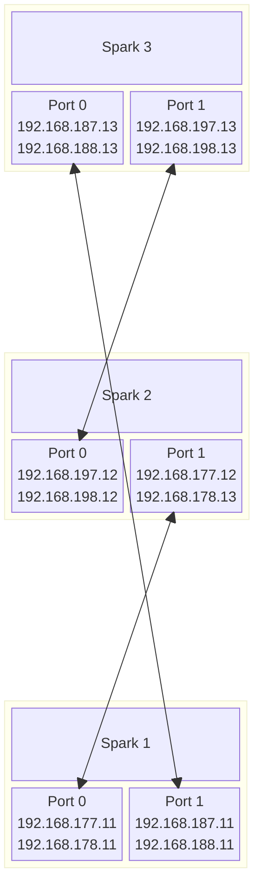

# DGX Spark Networking

The following guide starts with a two-node cluster, but it is also applicable to larger clusters.

See [this post](https://forums.developer.nvidia.com/t/6x-spark-setup/354399/56) for an example of 6-8 node Spark cluster.
Please keep in mind that tensor-parallel vLLM deployments usually work best with a number of nodes that corresponds to a power of 2, such as 2, 4, or 8 nodes. A 3-node mesh is mainly useful for pipeline parallelism or data parallelism.

The guide assumes that the nodes are named `spark` and `spark2`, but you can use any names.
Same with IP addresses: we use `192.168.177.0/24` subnet with `.11` and `.12` assigned to both nodes, but you can use any IP addresses, as long as they are in the same subnet.

## DGX Spark ConnectX quirks

DGX Spark has a pretty unique ConnectX setup.

To achieve 200G transfer speed, ConnectX NIC needs ~x8 PCIe 5.0 lanes.

However, DGX Spark SOC can't provide more than x4 PCIe lanes per device due to hardware limitations.
So to achieve 200G on a single cable connection, each physical port shares the same pair of PCIe5 x4 connections.
Each PCIe 5 x4 link is represented by two Ethernet and two RoCE interfaces:

```bash
eugr@spark:~$ ibdev2netdev
rocep1s0f0 port 1 ==> enp1s0f0np0 (Down)
rocep1s0f1 port 1 ==> enp1s0f1np1 (Up)
roceP2p1s0f0 port 1 ==> enP2p1s0f0np0 (Down)
roceP2p1s0f1 port 1 ==> enP2p1s0f1np1 (Up)
```

In this case, the single cable is plugged in the outermost QSFP port (the right one if looking from the back).
This port has two pairs of "twins" associated with it:

- Ethernet: `enp1s0f1np1` and `enP2p1s0f1np1`
- RoCE/IB: `rocep1s0f1` and `roceP2p1s0f1`

Each of the twins represents one PCIe x4 link and can provide up to 100G link speed.

For vLLM, we need RDMA over RoCE, so Ethernet speed is not that important, that's why we can assign IP only to one of the ports - in this case `enp1s0f1np1`.
However, in order to get full bandwidth in NCCL RDMA mode, we need to utilize **both** RoCE twins. It is achieved by setting `NCCL_IB_HCA` to both RoCE interfaces: `export NCCL_IB_HCA=rocep1s0f1,roceP2p1s0f1`

`./launch-cluster.sh` does this automatically, along with autodiscovery of interfaces, so as long as you set up your Ethernet interface properly, vLLM will utilize both RoCE twins.

Also, note that connecting two Sparks using **both** ports won't give you any noticeable advantage in bandwidth, so single connection is sufficient.
If you connect 3 Sparks by daisy-chaining them, you will only be able to sustain 100G between each pair of Sparks.

## Connecting 3 Sparks in a mesh cluster without a switch

Three Sparks can be connected together in a cluster without using a separate RoCE switch.
However, all three Sparks need to be on the same wired network using their 10G Ethernet ports (RJ-45, not QSFP). Being on the same wireless network should work too, but it's not recommended and was not tested.

You need to make sure they are connected the following way: port 0 on one Spark should connect to port 1 on another Spark (unlike non-mesh configuration).
Example diagram:



## Connecting more than 2 Sparks in the cluster using a switch

To connect more than 2 Sparks, you will need a proper switch, for example [Microtik CRS812-DDQ](https://mikrotik.com/product/crs812_ddq).
Please refer to [this post](https://forums.developer.nvidia.com/t/6x-spark-setup/354399/56) for an example of setting up a 6-8 node Spark cluster.

## Network setup

### For dual Sparks or multiple Sparks using a QSFP switch

Assuming both are connected using rightmost QSFP port (when looking from the back).

Create `/etc/netplan/40-cx7.yaml` on `spark`:
```yaml
network:
  version: 2
  ethernets:
    enp1s0f1np1:
      dhcp4: no
      dhcp6: no        # Explicitly disable DHCPv6
      link-local: []   # Restrict link-local addresses to static IPv4 only
      mtu: 9000
      addresses: [192.168.177.11/24]
    enP2p1s0f1np1:
      dhcp4: no
      dhcp6: no
      link-local: []
      mtu: 9000
      addresses: [192.168.178.11/24]
```

Create `/etc/netplan/40-cx7.yaml` on `spark2`:
```yaml
network:
  version: 2
  ethernets:
    enp1s0f1np1:
      dhcp4: no
      dhcp6: no        # Explicitly disable DHCPv6
      link-local: []   # Restrict link-local addresses to static IPv4 only
      mtu: 9000
      addresses: [192.168.177.12/24]
    enP2p1s0f1np1:
      dhcp4: no
      dhcp6: no
      link-local: []
      mtu: 9000
      addresses: [192.168.178.12/24]
```

**DO NOT use the same subnet on both "twins"** - it will confuse autodiscovery and mess up routing.

Then run on each node:

```bash
sudo chmod 600 /etc/netplan/40-cx7.yaml
sudo netplan apply
```

Set up passwordless ssh. On spark:

```bash
wget https://raw.githubusercontent.com/NVIDIA/dgx-spark-playbooks/refs/heads/main/nvidia/connect-two-sparks/assets/discover-sparks
chmod +x discover-sparks
./discover-sparks
```

MTU setting (testing):

```bash
sudo ip link set dev enp1s0f1np1 mtu 9000
```

### For 3-node mesh

3-node mesh is configured differently than dual clusters or clusters using a QSFP switch.

Assuming, your Sparks are connected according to the diagram above:

Create `/etc/netplan/40-cx7.yaml` on `spark1`:
```yaml
network:
  version: 2
  ethernets:
    enp1s0f0np0:
      dhcp4: no
      dhcp6: no        # Explicitly disable DHCPv6
      link-local: []   # Restrict link-local addresses to static IPv4 only
      mtu: 9000
      addresses: [192.168.177.11/24]
    enP2p1s0f0np0:
      dhcp4: no
      dhcp6: no
      link-local: []
      mtu: 9000
      addresses: [192.168.178.11/24]
    enp1s0f1np1:
      dhcp4: no
      dhcp6: no        # Explicitly disable DHCPv6
      link-local: []   # Restrict link-local addresses to static IPv4 only
      mtu: 9000
      addresses: [192.168.187.11/24]
    enP2p1s0f1np1:
      dhcp4: no
      dhcp6: no
      link-local: []
      mtu: 9000
      addresses: [192.168.188.11/24]
```

Create `/etc/netplan/40-cx7.yaml` on `spark2`:
```yaml
network:
  version: 2
  ethernets:
    enp1s0f0np0:
      dhcp4: no
      dhcp6: no        # Explicitly disable DHCPv6
      link-local: []   # Restrict link-local addresses to static IPv4 only
      mtu: 9000
      addresses: [192.168.197.12/24]
    enP2p1s0f0np0:
      dhcp4: no
      dhcp6: no
      link-local: []
      mtu: 9000
      addresses: [192.168.198.12/24]
    enp1s0f1np1:
      dhcp4: no
      dhcp6: no        # Explicitly disable DHCPv6
      link-local: []   # Restrict link-local addresses to static IPv4 only
      mtu: 9000
      addresses: [192.168.177.12/24]
    enP2p1s0f1np1:
      dhcp4: no
      dhcp6: no
      link-local: []
      mtu: 9000
      addresses: [192.168.178.12/24]
```

Create `/etc/netplan/40-cx7.yaml` on `spark3`:
```yaml
network:
  version: 2
  ethernets:
    enp1s0f0np0:
      dhcp4: no
      dhcp6: no        # Explicitly disable DHCPv6
      link-local: []   # Restrict link-local addresses to static IPv4 only
      mtu: 9000
      addresses: [192.168.187.13/24]
    enP2p1s0f0np0:
      dhcp4: no
      dhcp6: no
      link-local: []
      mtu: 9000
      addresses: [192.168.188.13/24]
    enp1s0f1np1:
      dhcp4: no
      dhcp6: no        # Explicitly disable DHCPv6
      link-local: []   # Restrict link-local addresses to static IPv4 only
      mtu: 9000
      addresses: [192.168.197.13/24]
    enP2p1s0f1np1:
      dhcp4: no
      dhcp6: no
      link-local: []
      mtu: 9000
      addresses: [192.168.198.13/24]
```

Then run (on each Spark):

```bash
sudo chmod 600 /etc/netplan/40-cx7.yaml
sudo netplan apply
```

### Passwordless SSH and benchmarks

Set up passwordless ssh. On the first spark:

```bash
wget https://raw.githubusercontent.com/NVIDIA/dgx-spark-playbooks/refs/heads/main/nvidia/connect-two-sparks/assets/discover-sparks
chmod +x discover-sparks
./discover-sparks
```

**Benchmark connection (use perftest package):**

Run the receiver on `spark2` node:

```bash
ib_write_bw -d rocep1s0f1 --report_gbits -q 4 -R --force-link IB
```

Then run on `spark`:

```bash
$ ib_write_bw 192.168.177.12 -d rocep1s0f1 --report_gbits -q 4 -R --force-link IB
```

```
---------------------------------------------------------------------------------------
                    RDMA_Write BW Test
 Dual-port       : OFF          Device         : rocep1s0f1
 Number of qps   : 4            Transport type : IB
 Connection type : RC           Using SRQ      : OFF
 PCIe relax order: ON
 ibv_wr* API     : ON
 TX depth        : 128
 CQ Moderation   : 1
 Mtu             : 1024[B]
 Link type       : IB
 Max inline data : 0[B]
 rdma_cm QPs     : ON
 Data ex. method : rdma_cm
---------------------------------------------------------------------------------------
 local address: LID 0000 QPN 0x03ec PSN 0xb680ae
 local address: LID 0000 QPN 0x03ed PSN 0x808800
 local address: LID 0000 QPN 0x03ee PSN 0x5b694a
 local address: LID 0000 QPN 0x03ef PSN 0xe2efd1
 remote address: LID 0000 QPN 0x03eb PSN 0x75f6ee
 remote address: LID 0000 QPN 0x03ec PSN 0x436140
 remote address: LID 0000 QPN 0x03ed PSN 0x81698a
 remote address: LID 0000 QPN 0x03ee PSN 0x4a8b11
---------------------------------------------------------------------------------------
 #bytes     #iterations    BW peak[Gb/sec]    BW average[Gb/sec]   MsgRate[Mpps]
 65536      20000            111.72             111.71             0.213070
---------------------------------------------------------------------------------------
```

**Latency test:**

Run the receiver on `spark2` node:

```bash
ib_write_lat -d rocep1s0f1 --report_gbits -R --force-link IB
```

Then run on `spark`:

```bash
ib_write_lat 192.168.177.12 -d rocep1s0f1 --report_gbits -R --force-link IB
```

```
---------------------------------------------------------------------------------------
                    RDMA_Write Latency Test
 Dual-port       : OFF          Device         : rocep1s0f1
 Number of qps   : 1            Transport type : IB
 Connection type : RC           Using SRQ      : OFF
 PCIe relax order: OFF
 ibv_wr* API     : ON
 TX depth        : 1
 Mtu             : 1024[B]
 Link type       : IB
 Max inline data : 220[B]
 rdma_cm QPs     : ON
 Data ex. method : rdma_cm
---------------------------------------------------------------------------------------
 local address: LID 0000 QPN 0x02ee PSN 0xb0c21c
 remote address: LID 0000 QPN 0x02ee PSN 0x14568b
---------------------------------------------------------------------------------------
 #bytes #iterations    t_min[usec]    t_max[usec]  t_typical[usec]    t_avg[usec]    t_stdev[usec]   99% percentile[usec]   99.9% percentile[usec]
 2       1000          1.42           1.93         1.47                1.47             0.00            1.57                    1.93
---------------------------------------------------------------------------------------
```

## NCCL Tests

### Dual Sparks or Sparks via QSFP switch

From https://build.nvidia.com/spark/nccl/stacked-sparks

```bash
# Install dependencies and build NCCL
sudo apt-get update && sudo apt-get install -y libopenmpi-dev
git clone -b v2.30u1 https://github.com/NVIDIA/nccl.git ~/nccl/
cd ~/nccl/
make -j src.build NVCC_GENCODE="-gencode=arch=compute_121,code=sm_121"

# Set environment variables
export CUDA_HOME="/usr/local/cuda"
export MPI_HOME="/usr/lib/aarch64-linux-gnu/openmpi"
export NCCL_HOME="$HOME/nccl/build/"
export LD_LIBRARY_PATH="$NCCL_HOME/lib:$CUDA_HOME/lib64/:$MPI_HOME/lib:$LD_LIBRARY_PATH"
```

Build NCCL Test Suite:

```bash
# Clone and build NCCL tests
git clone https://github.com/NVIDIA/nccl-tests.git ~/nccl-tests/
cd ~/nccl-tests/
make MPI=1
```

Test on both nodes:

```bash
# Set network interface environment variables (use your active interface)
export UCX_NET_DEVICES=enp1s0f1np1
export NCCL_SOCKET_IFNAME=enp1s0f1np1
export OMPI_MCA_btl_tcp_if_include=enp1s0f1np1
export NCCL_IB_HCA=rocep1s0f1,roceP2p1s0f1
export NCCL_IB_DISABLE=0

# Run the all_gather performance test across both nodes
mpirun -np 2 -H 192.168.177.11:1,192.168.177.12:1 \
  --mca plm_rsh_agent "ssh -o UserKnownHostsFile=/dev/null -o StrictHostKeyChecking=no" \
  -x LD_LIBRARY_PATH=$LD_LIBRARY_PATH \
  $HOME/nccl-tests/build/all_gather_perf -b 16G -e 16G -f 2

```

### 3-node mesh

```bash
# Install dependencies and build NCCL
sudo apt-get update && sudo apt-get install -y libopenmpi-dev
git clone -b v2.30u1 https://github.com/NVIDIA/nccl.git ~/nccl/
cd ~/nccl/
make -j src.build NVCC_GENCODE="-gencode=arch=compute_121,code=sm_121"

# Set environment variables
export CUDA_HOME="/usr/local/cuda"
export MPI_HOME="/usr/lib/aarch64-linux-gnu/openmpi"
export NCCL_HOME="$HOME/nccl/build/"
export LD_LIBRARY_PATH="$NCCL_HOME/lib:$CUDA_HOME/lib64/:$MPI_HOME/lib:$LD_LIBRARY_PATH"
```

Build NCCL Test Suite:

```bash
# Clone and build NCCL tests
git clone https://github.com/NVIDIA/nccl-tests.git ~/nccl-tests/
cd ~/nccl-tests/
make MPI=1
```

Test on all three nodes (replace `spark1`, `spark2`, and `spark3` with the actual hostnames or IP addresses on the non-QSFP interface):

```bash
# Set environment variables
export CUDA_HOME="/usr/local/cuda"
export MPI_HOME="/usr/lib/aarch64-linux-gnu/openmpi"
export NCCL_HOME="$HOME/nccl/build/"
export LD_LIBRARY_PATH="$NCCL_HOME/lib:$CUDA_HOME/lib64/:$MPI_HOME/lib:$LD_LIBRARY_PATH"

# For 3-node mesh we have to use 10G interface for OOB communication!
export UCX_NET_DEVICES=enP7s7
export NCCL_SOCKET_IFNAME=enP7s7
export OMPI_MCA_btl_tcp_if_include=enP7s7
export NCCL_IB_HCA=rocep1s0f0,roceP2p1s0f0,rocep1s0f1,roceP2p1s0f1
export NCCL_IB_DISABLE=0

# Run the all_gather performance test across all three nodes
mpirun -np 3 -H spark1:1,spark2:1,spark3:1 \
  --mca plm_rsh_agent "ssh -o UserKnownHostsFile=/dev/null -o StrictHostKeyChecking=no" \
  -x LD_LIBRARY_PATH=$LD_LIBRARY_PATH -x NCCL_IB_MERGE_NICS=0 -x NCCL_NET_PLUGIN=none -x NCCL_IB_SUBNET_AWARE_ROUTING=1 \
  $HOME/nccl-tests/build/all_gather_perf -b 16G -e 16G -f 3
```
